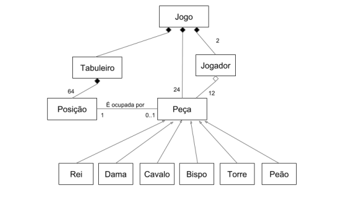

# Xadrez ( Programação Orientada a Objetos)

Projeto em c++ aplicando e exercitando os conceito de orientação a objeto.

# Decisões de Projeto

## Peça 
Classe que representa as funcionalidades gerais comuns a todas as peças, e serve
de base para todas as outras.

### Peça específica (Rei, Dama, Cavalo, Bispo, Torre, Peão)
Responsável pelo desenho da peça na tela e checagem da adequação do movimento que o usuário
deseja fazer em relação ao tipo específico de peça. Cada peça também é responsável por
manter a sua situação (se está capturada ou em jogo). Deve ter no mínimo os métodos:
- desenha(), que vai desenhar a peça específica na tela.
- checaMovimento(linhaOrigem, colunaOrigem, linhaDestino, colunaDestino), que vai
verificar se o movimento que o usuário deseja fazer é adequado para aquele tipo
específico de peça.

## Tabuleiro
Um tabuleiro contém 64 posições organizadas em 8 linhas e 8 colunas. Essa classe é responsável pela configuração inicial do tabuleiro, manutenção da configuração do tabuleiro a cada jogada e pelas checagens de adequação dos movimentos solicitados.

## Posição
Cada posição tem uma cor (branco ou preto), uma linha (de a a h) e uma coluna
(de 1 a 8). Cada posição pode estar vazia ou ocupada por uma peça e deve saber que peça
a ocupa.

## Jogador
Cada jogador tem um nome, um conjunto de peças de uma das cores possíveis e
sabe quais peças suas ainda estão ativas no jogo.

## Jogo
Essa classe é responsável pelo gerenciamento do jogo, controlando tudo o que
acontece no jogo. Essa classe contém um tabuleiro, 2 jogadores e o conjunto de 24 peças
disponíveis. Sabe também de que jogador é a vez, controlando as
jogadas, as vezes, as checagens, etc, sendo a principal responsável pela comunicação com
os usuários